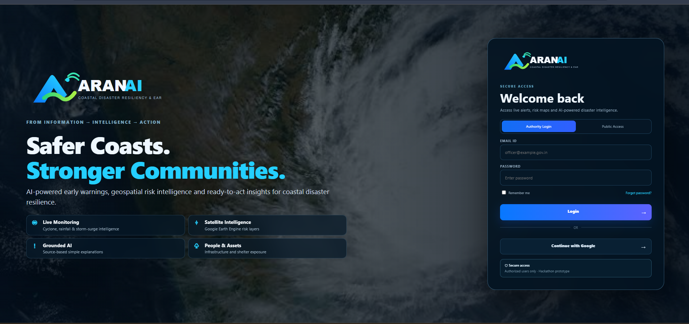
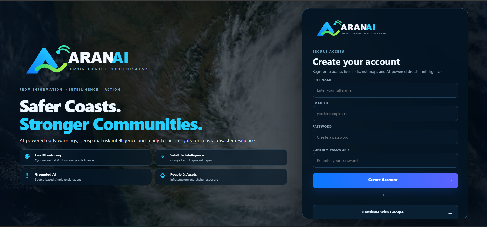
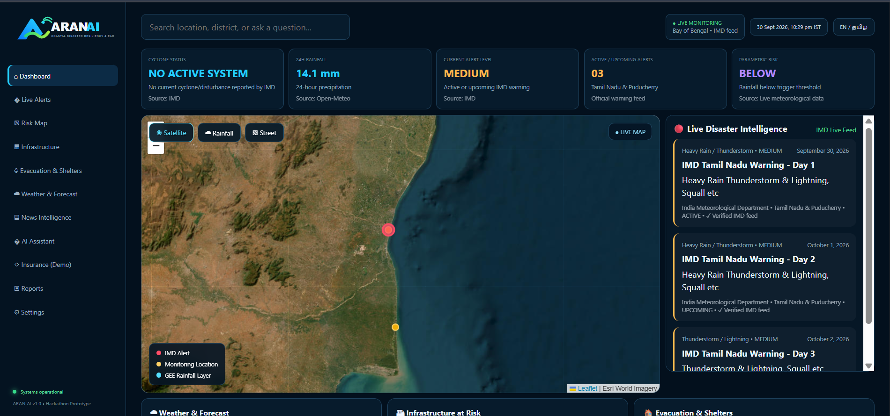
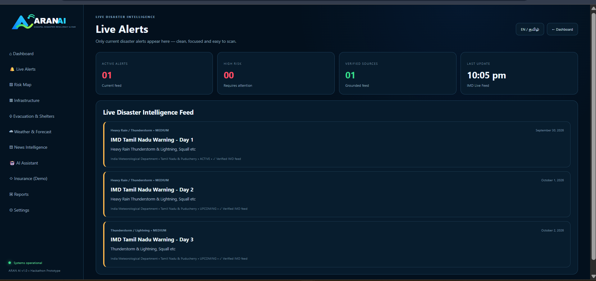
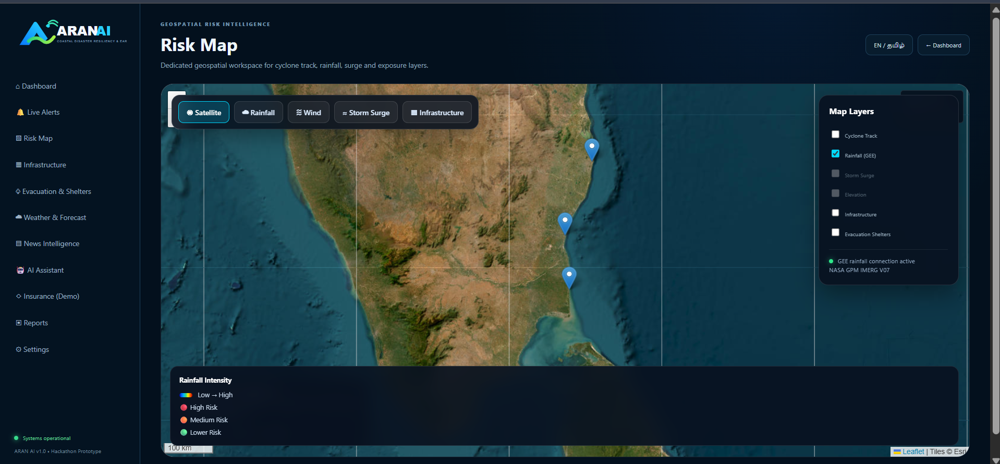
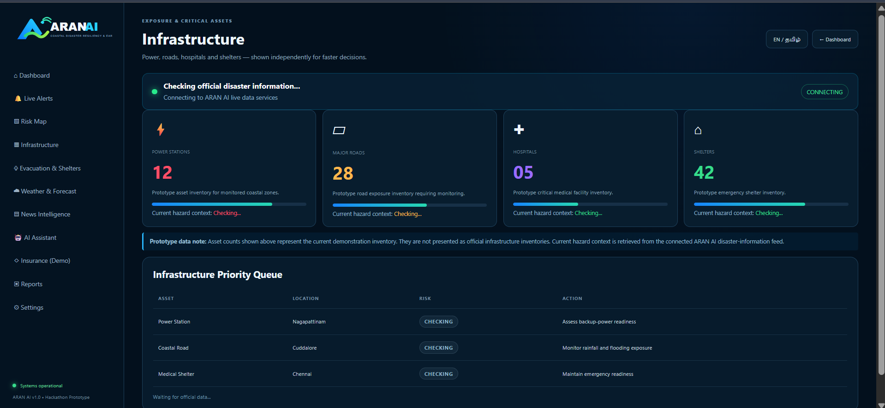
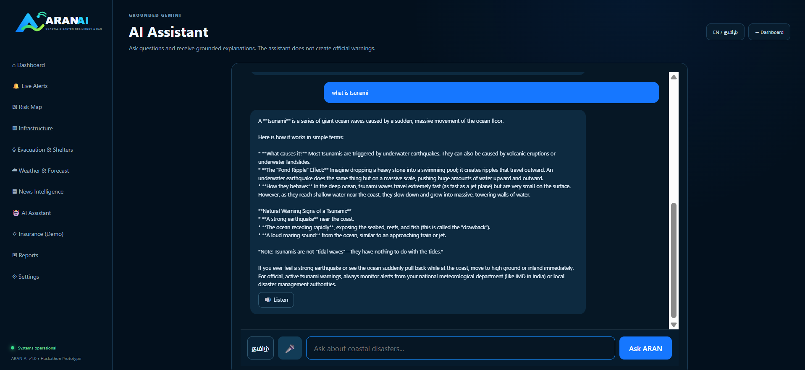
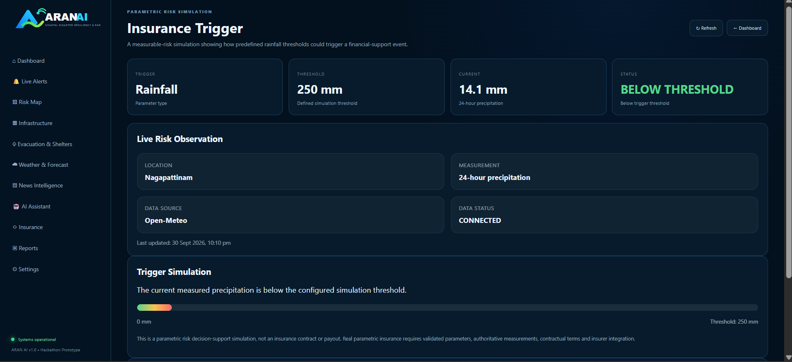

# 🌊 ARAN AI

## AI-Powered Coastal Disaster Resiliency & Grounded Early-Warning Platform

> **From Information → Intelligence → Action**

ARAN AI is an AI-powered coastal disaster intelligence platform designed to support anticipatory disaster preparedness by combining disaster information, meteorological data, geospatial intelligence, infrastructure awareness, and AI-powered assistance in a unified platform.

### 🔗 Live Application

**https://aran-ai.onrender.com**

---

## 🚨 Problem

Coastal communities are exposed to multiple interconnected hazards such as:

- 🌪️ Cyclones
- 🌧️ Heavy rainfall
- 🌊 Flooding
- 🌊 Storm surge
- 🏗️ Infrastructure disruption
- 🌦️ Extreme coastal weather

Disaster information is often distributed across different sources, making it difficult to quickly understand:

- What is happening?
- Where is it happening?
- How severe is the situation?
- Which areas or infrastructure may be exposed?
- What information requires immediate attention?

ARAN AI brings relevant disaster intelligence into a single decision-support platform.

---

## 💡 Our Solution

ARAN AI follows a simple workflow:

**Information → Intelligence → Action**

The platform combines disaster information, weather data, geospatial analysis, and grounded AI assistance to help users understand disaster situations more clearly.

ARAN AI is designed as a **disaster information and decision-support platform**.

It does not replace official emergency-warning systems or disaster-management authorities.

---

# 🖥️ Platform Features

## 🔐 1. Secure Authentication

ARAN AI provides Firebase-powered authentication for secure access to the platform.

Users can authenticate using:

- Email and password
- Google Sign-In
- Firebase Authentication

### Login Page

<p align="center">
  
</p>

---

## 📝 2. User Registration

New users can create an ARAN AI account using:

- Full Name
- Email Address
- Password
- Confirm Password

The registration process is connected to Firebase Authentication.

### Register Page

<p align="center">
  
</p>

---

## 📊 3. Disaster Intelligence Dashboard

The ARAN AI dashboard provides a centralized view of the platform's major disaster-intelligence modules.

The dashboard provides access to:

- Live Alerts
- Risk Map
- Infrastructure
- Shelters
- Weather
- AI Assistant
- Reports
- Parametric Risk Simulation

### Dashboard Preview

<p align="center">
  
</p>

---

## 🚨 4. Live Disaster Alerts

The Live Alerts module provides disaster and weather information in a structured format.

Alert information can include:

- 📍 Location
- 🕐 Timestamp
- ⚠️ Hazard type
- 🔴 Severity
- 📡 Source
- 🤖 AI-generated explanation

The system is designed to prioritize authoritative disaster and meteorological information.

### Live Alerts Preview

<p align="center">
  
</p>

---

## 🌀 5. Cyclone Intelligence

ARAN AI provides cyclone and weather-system information as part of its disaster intelligence layer.

The platform can present:

- Cyclone or disturbance information
- System type
- Relevant location
- Severity context
- Source information
- Weather-system context

Technical weather information is intended to be explained in a more understandable way for users.

---

## 🌧️ 6. Rainfall Intelligence

Rainfall intelligence combines meteorological information with geospatial analysis.

The system supports:

- Rainfall visualization
- Geographic analysis
- Risk interpretation
- Disaster preparedness awareness

Google Earth Engine is used as part of the geospatial intelligence workflow.

---

## 🗺️ 7. Geospatial Risk Map

The Risk Map provides a geographic interface for viewing disaster-related geospatial information.

It is designed to help users understand:

- Geographic conditions
- Rainfall-related risk
- Coastal areas of interest
- Map layers
- Infrastructure exposure

### Risk Map Preview

<p align="center">
  
</p>

---

## 🏗️ 8. Infrastructure Exposure

The Infrastructure module provides awareness of potentially exposed critical assets.

The module focuses on categories such as:

- 🛣️ Roads
- ⚡ Power infrastructure
- 🏥 Medical facilities
- 🚑 Emergency assets

### Infrastructure Preview

<p align="center">
  
</p>

> **Prototype Note:** Where verified official infrastructure datasets are not yet integrated, the current prototype may use reference or demonstration inventory.

---

## 🏥 9. Shelter Awareness

The Shelter module provides an interface for disaster-preparedness and shelter-related information.

It is designed to help users understand shelter information within the platform.

> **Prototype Note:** Current shelter information should be treated as reference/demo information and not as an official emergency shelter registry.

---

## 🌦️ 10. Weather Intelligence

The Weather module provides meteorological information to support disaster awareness.

Weather information can be interpreted alongside:

- Cyclone information
- Rainfall intelligence
- Live alerts
- Risk-map information

This helps provide broader context around coastal weather conditions.

---

## 🤖 11. Gemini AI Disaster Assistant

ARAN AI includes a Gemini-powered AI assistant for disaster-related questions.

Users can ask about:

- Cyclones
- Heavy rainfall
- Floods
- Storm surge
- Coastal weather
- Disaster preparedness
- Infrastructure exposure
- Emergency preparedness

### AI Assistant Preview

<p align="center">
  
</p>

### Grounded AI Approach

The assistant is designed to work with source-aware information and avoid inventing critical facts such as:

- Fake evacuation orders
- Fake government instructions
- Fake cyclone coordinates
- Fake rainfall measurements
- Fake road closures
- Fake official warnings

The AI is intended to explain verified or provided information rather than replace official disaster authorities.

Critical emergency information should always be verified with appropriate official sources.

---

## 💰 12. Parametric Risk Simulation

ARAN AI includes a prototype parametric risk decision-support module.

The basic workflow is:

**Rainfall Measurement → Threshold Comparison → Risk Status → Decision Support**

### Parametric Risk Preview

<p align="center">
  
</p>

> **Prototype Note:** This is a decision-support simulation. It is not an insurance contract and does not represent an actual insurance payout.

---

## 📄 13. Reports

The Reports module is designed to organize disaster-related information into a structured interface.

It can support:

- Disaster summaries
- Situation reports
- Risk reports
- Preparedness information
- Decision-support documentation

---

# 🧠 ARAN AI Intelligence Workflow

ARAN AI follows a source-aware disaster intelligence workflow:

**Retrieve → Verify → Ground → Analyze → Explain → Localize → Support Action**

The overall concept is:

**Information → Intelligence → Action**

The goal is to transform complex disaster information into understandable decision-support information while preserving the meaning of the original source.

---

# 🏗️ System Architecture

```text
             Disaster Information
                      │
                      ▼
             Weather / Satellite
                      │
                      ▼
            Google Earth Engine
                      │
                      ▼
                Flask Backend
                      │
          ┌───────────┴───────────┐
          ▼                       ▼
      Gemini AI              Risk Analysis
          │                       │
          └───────────┬───────────┘
                      ▼
                  ARAN AI UI
                      │
        ┌─────────────┼─────────────┐
        ▼             ▼             ▼
      Alerts       Risk Map      Weather
        │             │             │
        └─────────────┼─────────────┘
                      ▼
          Infrastructure / Shelters
                      │
                      ▼
              AI Assistant / Reports
☁️ Google Technology Integration
🤖 Google Gemini

Gemini is used for:

AI-powered reasoning
Disaster explanations
Natural-language interaction
Disaster-preparedness assistance
Multilingual interaction
🛰️ Google Earth Engine

Google Earth Engine supports:

Satellite-derived geospatial intelligence
Rainfall analysis
Geographic visualization
Earth-observation workflows
🔐 Firebase

Firebase provides:

Authentication
Google Sign-In
User account management
Application data infrastructure
☁️ Google Cloud

The architecture is designed for cloud deployment and future integration with additional Google Cloud services.

🖥️ Platform Modules
Module	Purpose
📊 Dashboard	Central disaster intelligence overview
🚨 Live Alerts	Disaster and weather alerts
🗺️ Risk Map	Geospatial risk visualization
🏗️ Infrastructure	Infrastructure exposure awareness
🏥 Shelters	Shelter-awareness interface
🌦️ Weather	Weather and rainfall information
📰 News	Disaster-related information
🤖 AI Assistant	Gemini-powered disaster assistance
💰 Risk Simulation	Rainfall threshold decision support
📄 Reports	Disaster information reporting
⚙️ Settings	Application settings
🔐 Authentication	Firebase authentication
🔎 Data Provenance & Safety

ARAN AI follows a source-aware approach.

The system is designed to:

Prefer authoritative sources
Preserve source meaning
Identify information sources
Display relevant timestamps
Explain technical terminology
Separate source information from AI-generated explanations

ARAN AI does not replace official disaster-management systems.

Critical emergency decisions, evacuation orders, and official warnings should always be verified with appropriate authorities.

🛠️ Technology Stack
Frontend
HTML5
CSS3
JavaScript
Leaflet
Responsive dashboard UI
Backend
Python
Flask
REST APIs
Artificial Intelligence
Google Gemini
Gemini-powered reasoning
Geospatial Intelligence
Google Earth Engine
Satellite-derived datasets
Geospatial visualization
Authentication & Cloud
Firebase Authentication
Google Sign-In
Google Cloud
Render
External Data
Meteorological APIs
Disaster information sources
Map and tile services
📁 Project Structure
ARAN-AI-final-fixed/
│
├── app.py
│
├── data/
│   └── alerts.json
│
├── docs/
│   └── screenshots/
│       ├── aran-login.png
│       ├── aran-register.png
│       ├── aran-dashboard.png
│       ├── aran-live-alerts.png
│       ├── aran-risk-map.png
│       ├── aran-ai-assistant.png
│       ├── aran-infrastructure.png
│       └── aran-insurance.png
│
├── services/
│
├── static/
│   ├── css/
│   ├── images/
│   └── js/
│
├── templates/
│
├── .env.example
├── .gitignore
├── README.md
└── requirements.txt
⚙️ Local Setup
1. Clone the Repository
git clone https://github.com/AFree-123/ARAN-AI.git
cd ARAN-AI
2. Create Virtual Environment
python -m venv venv
Windows
venv\Scripts\activate
3. Install Dependencies
pip install -r requirements.txt
4. Configure Environment Variables

Create a .env file using .env.example as a reference.

Do not commit:

Private API keys
Service-account files
Passwords
Other credentials
5. Run the Application
python app.py

Open:

http://127.0.0.1:5000

🌐 Deployment

ARAN AI is deployed as a Flask web application using Render.

Live Application

https://aran-ai.onrender.com

The application is connected to the GitHub repository and deployed through Render.

🌏 Coastal India Focus

ARAN AI is designed with coastal India as an important deployment context.

The architecture can be extended to vulnerable coastal regions including:

Tamil Nadu
Andhra Pradesh
Odisha
West Bengal
Kerala
Karnataka
Maharashtra
Gujarat

With appropriate datasets and authorized integrations, the architecture can be extended to broader Asia-Pacific coastal regions.

🚀 Future Scope
Advanced Hazard Modelling
Storm-surge modelling
Flood propagation modelling
Multi-hazard forecasting
Higher-resolution rainfall analysis
Infrastructure Intelligence
Verified power-grid datasets
Road-network data
Hospital and medical facility datasets
Critical infrastructure datasets
Emergency Workflows
Authorized disaster-management integrations
Automated alert workflows
Notification systems
Emergency-response coordination
AI & Automation
Continuous disaster monitoring
Automated event detection
Situation reports
Alert prioritization
Automated summaries
Community Accessibility
More Indian languages
Mobile-first experience
Low-bandwidth support
Voice-based disaster information
🎯 Expected Impact

ARAN AI aims to support a shift from:

Reactive Disaster Response → Anticipatory Disaster Intelligence

The platform focuses on helping users:

Understand disaster information earlier
Connect information faster
Visualize geographic exposure
Interpret complex information
Support preparedness decisions
🧪 Current Prototype Status

ARAN AI currently demonstrates:

✅ Firebase Authentication
✅ Google Sign-In
✅ User Registration
✅ Gemini AI Assistant
✅ Google Earth Engine integration
✅ Rainfall visualization
✅ Cyclone information
✅ Disaster alerts
✅ Infrastructure awareness
✅ Shelter awareness
✅ Weather information
✅ Parametric risk simulation
✅ Reports
✅ Multilingual interaction
✅ Cloud deployment

Some infrastructure and shelter information may currently use prototype/reference data and should be replaced with verified official datasets for production deployment.

🏆 Hackathon Context

ARAN AI was developed for an AI and Google Cloud-focused disaster resilience challenge centered on:

Cyclone Impact & Infrastructure Vulnerability Forecasting

The project applies:

Artificial Intelligence
Satellite data
Meteorological information
Geospatial intelligence

to support:

Cyclone preparedness
Rainfall-risk awareness
Storm-surge understanding
Infrastructure vulnerability awareness
Early-warning decision support
🔮 Vision

The long-term vision of ARAN AI is to build a scalable coastal disaster intelligence layer connecting:

**Earth Observation

Weather Intelligence
Official Disaster Information
Artificial Intelligence
Geospatial Risk Analysis**

↓

Better Disaster Preparedness

👩‍💻 Author

Ms. A. Afreena

B.Tech Information Technology
Sir Isaac Newton College of Engineering and Technology
Tamil Nadu, India

⚠️ Disclaimer

ARAN AI is a prototype research and technology demonstration platform.

It is intended for:

Information
Visualization
Decision support

It does not replace:

Official warnings
Evacuation instructions
Emergency services
Disaster-management authorities
Meteorological agencies
Government communications

Always verify critical emergency information with official authorities.